基于Springboot的零食商城系统
=

### 完整代码获取地址：从戎源码网 ([https://armycodes.com/](https://armycodes.com/))
### 作者微信：19941326836  QQ：952045282 
### 承接计算机毕业设计、Java毕业设计、Python毕业设计、深度学习、机器学习
### 选题+开题报告+任务书+程序定制+安装调试+论文+答辩ppt 一条龙服务
### 所有选题地址https://github.com/nature924/allProject

一、项目介绍
---

基于 Spring Boot 的零食商城系统，系统角色为 管理员（后台）、顾客（前台）和供应商/采购，主要功能如下

管理员：
基本操作：登录、修改密码、获取/修改个人信息
商品管理：商品添加、修改、删除、上下架、设定是否新品、管理库存/最低库存、商品图片、按名称/分类/品牌搜索、按分类/品牌/规格统计与查询
分类/品牌/规格管理：新增/编辑/删除/名称检查、获取列表
订单管理：查看订单列表、订单详情（含物流）、修改订单状态（发货/确认收货/删除）、订单统计
采购与供应商：供应商 CRUD、采购记录管理、采购收货（入库并更新库存）
购物车与下单管理：管理用户购物车、支持购物车下单、临时订单信息写入 Redis
用户与权限管理：查询用户列表（顾客/管理员）、删除用户、角色授权（user-role 管理）、VIP 管理（添加/续期/删除）
营销与评价：轮播图（Banner）管理、商品评价管理

顾客（前台用户）：
账户：注册、登录、找回密码、个人中心（信息查看/修改）
商品浏览：商城首页、分类/品牌/关键字搜索、商品详情查看
购物车：加入购物车、修改数量、删除、查看
下单与支付：单品购买或购物车合并下单（支持将订单信息临时存 Redis）、调用支付（集成支付宝 SDK）
订单：查看我的订单、订单详情、确认收货、申请退货/查看退货进度
评价与会员：商品评价、购买/管理 VIP（会员购买与过期控制）

供应商 / 采购角色：
供应商信息管理：供应商列表/新增/修改/删除/启用状态
采购记录：添加采购、查看采购列表、采购收货（更新商品库存）

二、项目技术
---
- 编程语言：Java
- 数据库：MySQL
- 项目管理工具：Maven
- 前端技术：VUE、HTML、Jquery、Bootstrap
- 后端技术：Spring、SpringMVC、MyBatis

三、运行环境
---
- 操作系统：Windows、macOS都可以
- JDK版本：JDK1.8以上都可以
- 开发工具：IDEA、Ecplise、Myecplise都可以
- 数据库: MySQL5.7以上都可以
- Tomcat：任意版本都可以
- Maven：任意版本都可以

四、运行截图
---

### 程序截图：
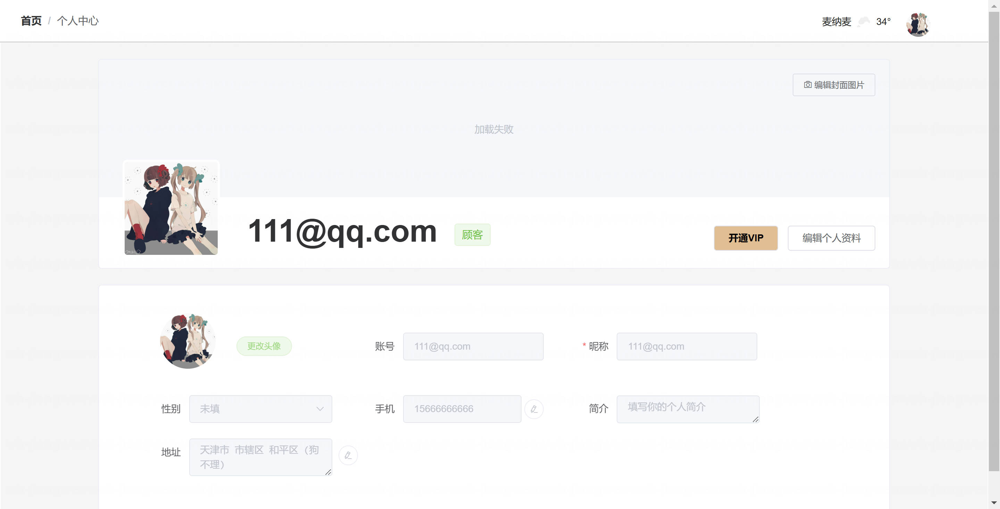
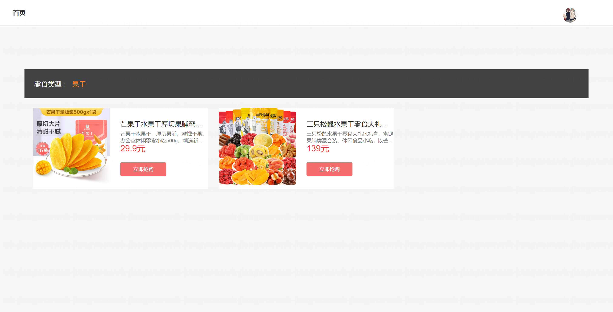
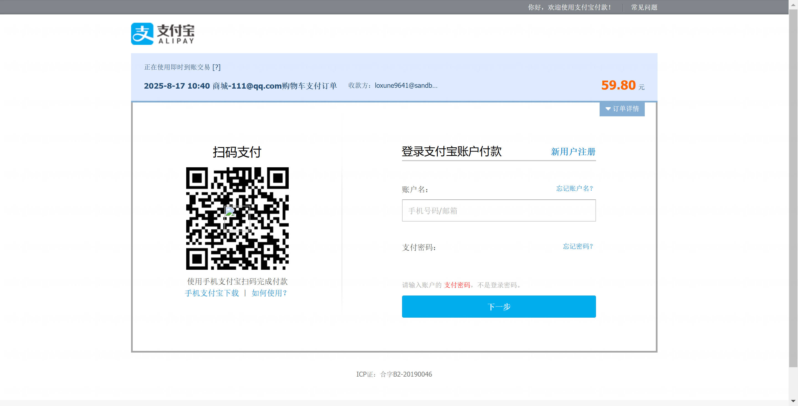
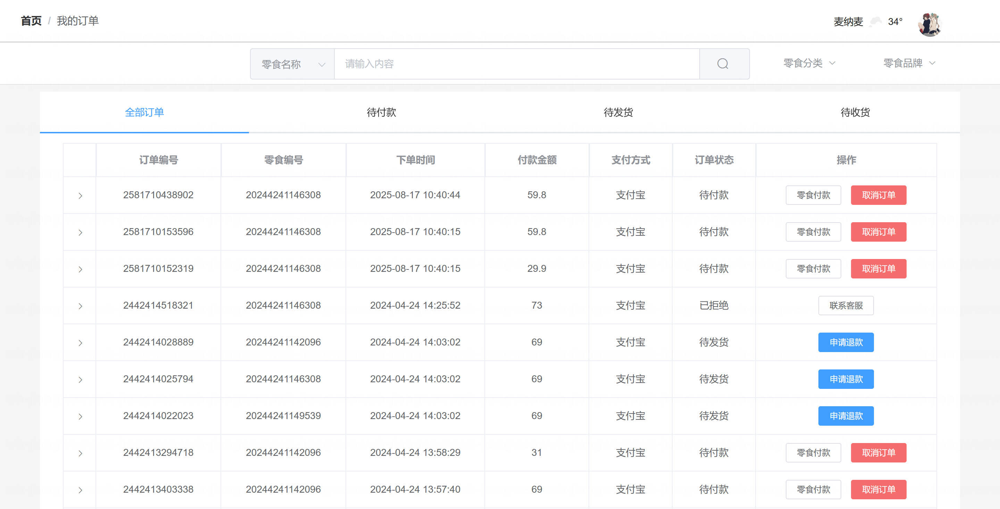
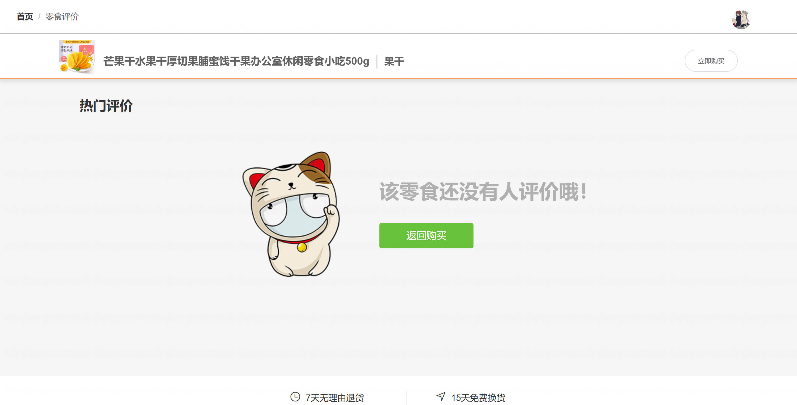
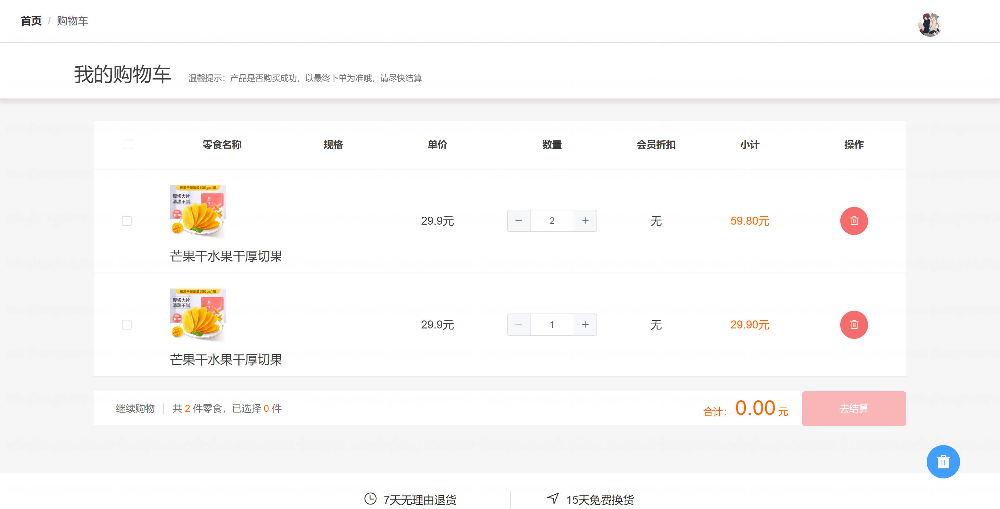
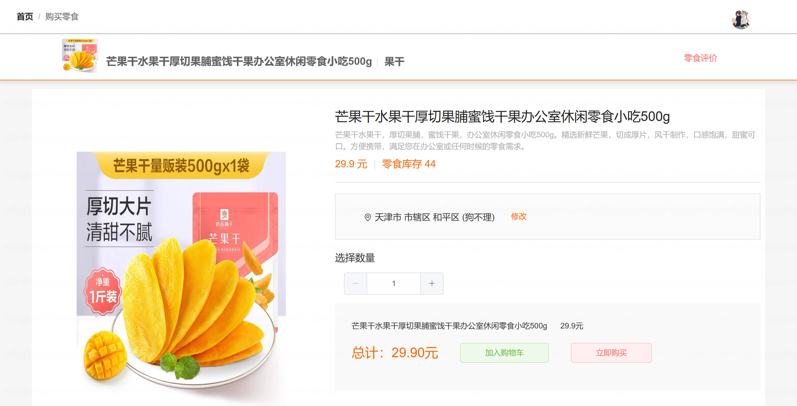

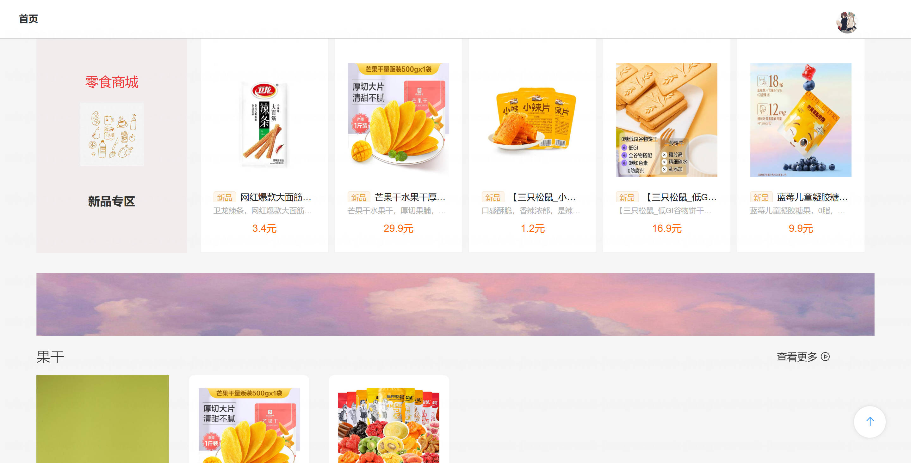
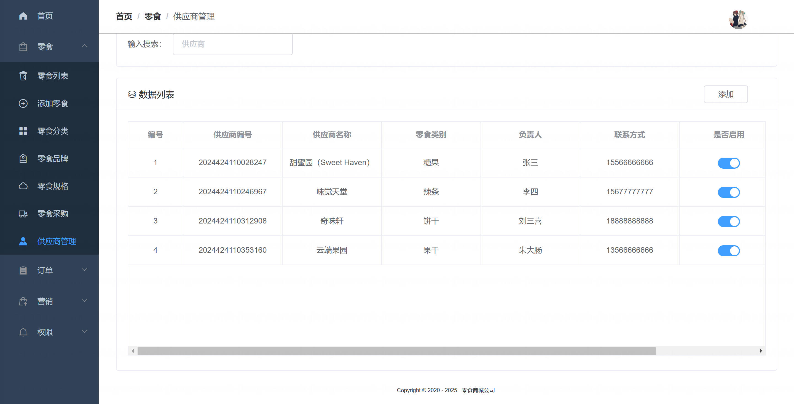
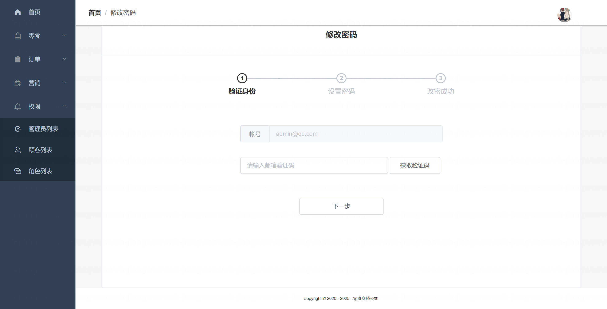
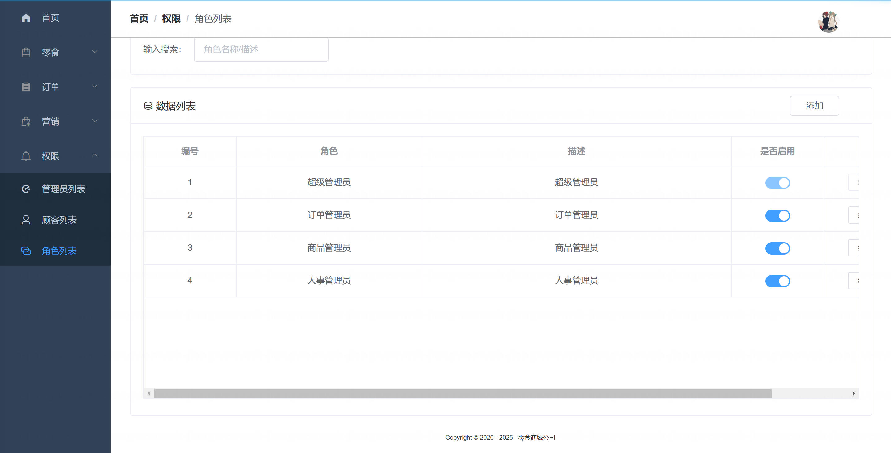

